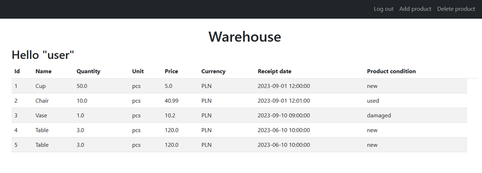
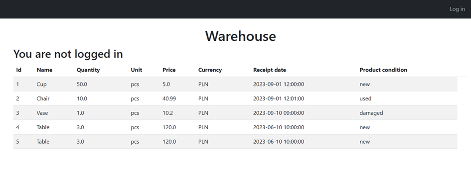
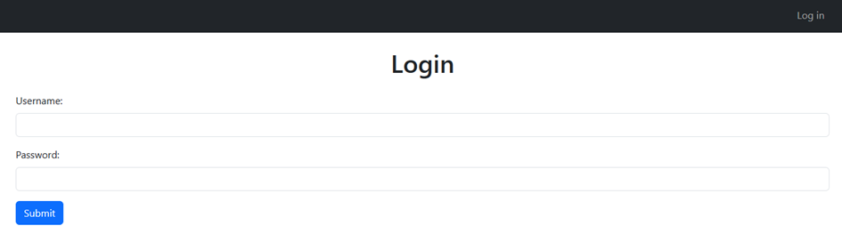
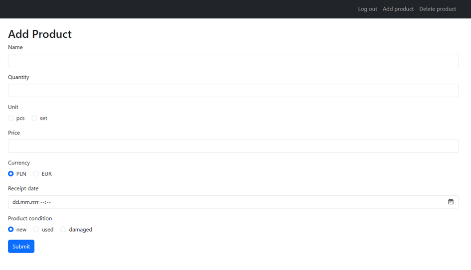
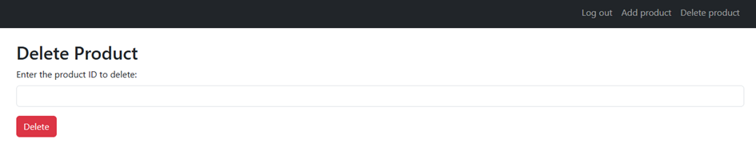

# Warehouse - Web App


## General info
A simple web application designed for managing warehouse inventory. It presents products stored in a database and allows for the add and remove products after logging in.

## Technologies
Project is created with:
* Python 3.12.0

The application has been developed using the **Flask** framework and utilizes the **PostgreSQL** database running as a **Docker** container.

## Setup
Make sure you have installed **Docker**.

To run this project:

```
$ docker compose up
```
Open the browser and go to: http://localhost.



To add or remove a product, logging in is required – the details are provided in the 'users_03_init.sql'







